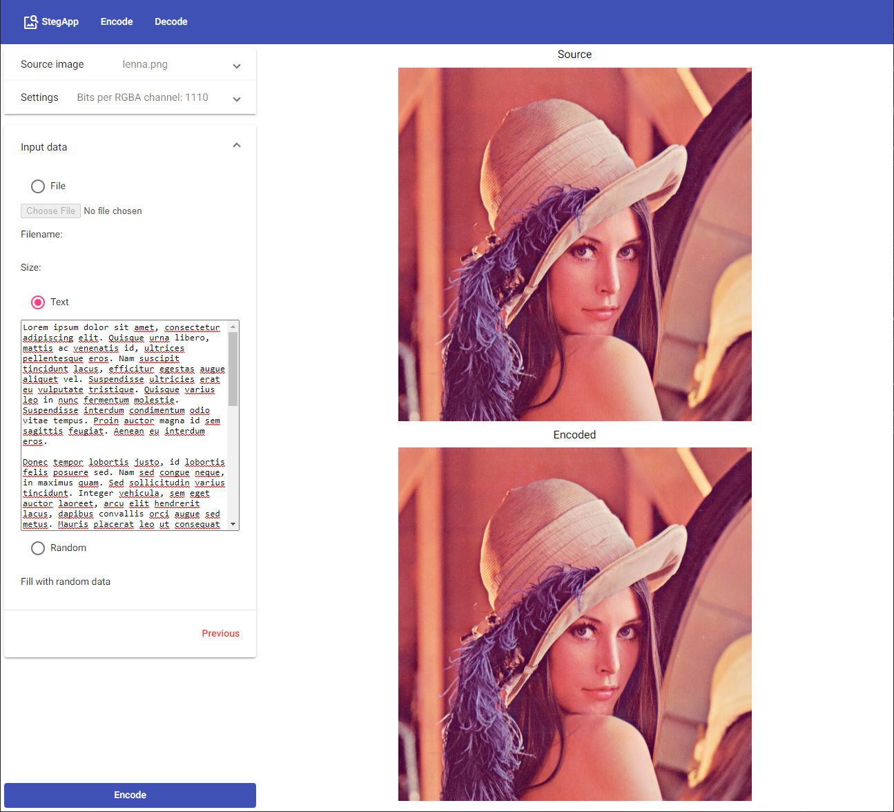

# StegApp

[Steganography](https://en.wikipedia.org/wiki/Steganography) on wikipedia:  
> Steganography (/ˌstɛɡəˈnɒɡrəfi/ STEG-ə-NOG-rə-fee) is the practice of concealing a message within another message or a physical object. In computing/electronic contexts, a computer file, message, image, or video is concealed within another file, message, image, or video.

[StegApp](https://stegapp-bff11.web.app/) is an open source webapp to encode information in images.  
All logic runs locally on your browser.

## Documentation

Information is encoded on the least significant bits of each subpixel (RGBA); how many bits are used is configurable, with more bits resulting in exponentially more noticeable changes.  
A header contains the necessary parameters to decode and recover the information.  

### Header

#### Parameters

||Size \[bits\]|
|---|:---:|
|Bits per Red subpixel|4|
|Bits per Green subpixel|4|
|Bits per Blue subpixel|4|
|Bits per Alpha subpixel|4|
|Data length|Variable \[1\]|

 

Header is always encoded with the same parameters so it can be decoded later: 1 bit/RGB, 0 bits/A  
Bits/subpixel values are saved using 4 bits, this allows values 0-8. Using 8 bits/subpixel is unrealistic, since it completely replaces the original data, so it could be reduced to only 3 bits for 0-7 values. This would save 4 bits which translates to 2 pixels.  
\[1\]: Data length varies based on image dimensions and encoding options. It's value is encoded using as many bits as necessary for the maximum length.

## UI
### Encoding

### Decoding

